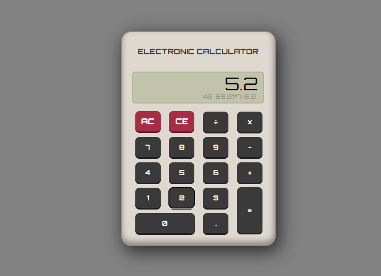

# Simple Calculator 🧮

A simple yet functional calculator built using HTML, CSS, and JavaScript. This calculator includes essential arithmetic operations (+, -, *, /), backspacing, clear all, and decimal point features.



## Features

- **Addition (+)**
- **Subtraction (-)**
- **Multiplication (*)**
- **Division (/)**
- **Backspace:** Remove the last entered digit
- **Clear All:** Reset the calculator
- **Decimal Point (.)**

## Technologies Used


## Design Inspiration

This calculator design is inspired by [this example](https://codepen.io/freeCodeCamp/full/MeQyjB).

## Getting Started

To get a local copy up and running follow these simple steps:

### Prerequisites

- Clone the repository
  ```bash
  git clone https://github.com/your-username/calculator.git
